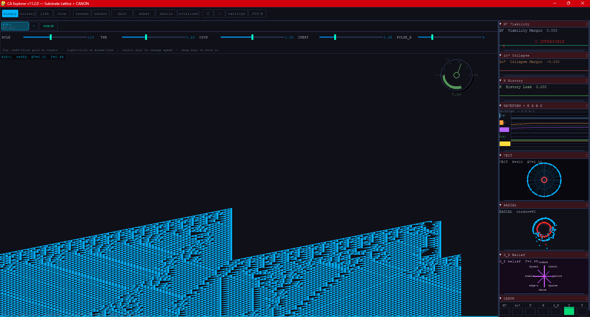
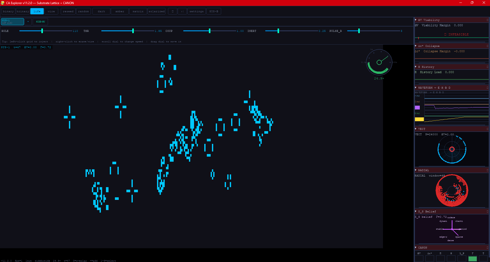
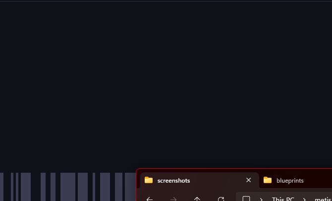
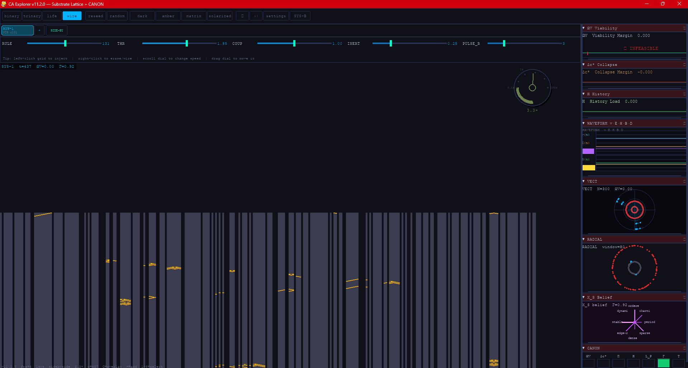

# CA Explorer v11
### Substrate Lattice Visualization + CANON Viability Analysis

**Version:** 11.2.0  
**Status:** Active development  
**Author:** Paul Tobin Peck  
**Framework:** Scalar-3³ Persistence Architecture

---

## What This Is

CA Explorer is an interactive instrument for studying how systems persist, fail, and interact under constraint. It is not a toy or a screensaver.

The program runs one or more cellular automata simultaneously, maps each one into a 9-dimensional coordinate system called the **Substrate Lattice**, and computes **CANON viability metrics** in real time — telling you not just what the system is doing, but how close it is to collapse and why.

The foundational equation governing every system in this program:

```
X_{t+1} = Π_K(F(X_t))
```

Where `X` is a 9D state vector, `F` is the CA evolution operator, `K` is the constraint region, and `Π_K` is the feasibility projection. Every tick, every system, every mode: this is the law.

---

## Quickstart

```bash
pip install -r requirements.txt
python run.py
```

**Requirements:** Python 3.9+, pygame ≥ 2.1, numpy ≥ 1.21, scipy ≥ 1.7

---

## CA Modes

| Mode | Type | Description | Default Rule |
|---|---|---|---|
| **binary** | 1D Elementary CA | 2-state, Wolfram rules 0–255 | Rule 110 |
| **trinary** | 1D 3-state CA | States map to −/0/+ (shed/contain/reinforce) | Rule 777 |
| **life** | 2D Conway variants | Conway, Highlife, Day & Night, Seeds | Conway |
| **wire** | 1D Wireworld | Electron heads propagate through wire | — |

### State Colors (discrete, not gradients)

**Binary:** background = dead · primary color = live  
**Trinary:** grey = contain (0) · green = reinforce (+) · red = shed (−)  
**Wireworld:** dark = empty · dim blue-grey = wire · bright yellow = electron head · orange = tail  
**Life:** background = dead · system color = live

---

## Screenshots

### Binary — Rule 110

Rule 110 is the only elementary CA proven capable of universal computation. The spacetime strip reads top-to-bottom: each row is one generation, the current generation at the bottom. Complex, non-repeating structure emerges from a single live cell seeded at centre.



The triangular structures are Rule 110's signature: deterministic yet never periodic, never fully chaotic. The asymmetric propagation (the rule treats left and right neighbours differently) produces the diagonal lean visible in all runs. The RADIAL panel in the sidebar shows the spatial distribution of live cells mapped to a polar axis; VECT shows the current generation distributed around a circle, with the tight cluster near centre reflecting the high density of a fully-developed Rule 110 spacetime strip.

---

### Life — Conway

Conway Life runs on a 2D grid. Each cell lives or dies based on its 8-neighbour count. At default density a random seed produces gliders, oscillators, still lifes, and large ephemeral structures before settling into a stable mix.



The RADIAL panel here has filled almost entirely red — sustained high positive-polarity density across the full spatial window, consistent with a grid that has passed its explosive initial phase and stabilised into oscillators. The X_S Belief spider chart shows the system reading primarily as "ordered" and "periodic", which matches: most of what survives the initial chaos is periodic structure.

---

### Trinary — 3-State CA

The trinary engine implements the shed / contain / reinforce semantics directly. State 0 (grey) is load-bearing containment — not absence. State 1 (green) is active reinforcement. State 2 (red) is shedding. The spacetime strip reads the same way as binary: time flows downward.



The trinary CA produces long diagonal structures similar to binary rules but with a third state capable of damming or routing propagating waves. The trinary-specific coloring (grey/green/red) is most visible in the sidebar panels — particularly X_S Belief and RADIAL — which reflect the system's interpretation of its own state distribution across the shed/contain/reinforce categories.

---

### Wire — Wireworld

Wireworld shows the lifecycle of electron signals through a circuit. Dark blue-grey = static wire. Bright yellow = electron head (active signal front). Orange = electron tail (one step behind the head, decaying back to wire). Black = empty space.



The vertical striping is the wire lattice — static, grey-blue. The diagonal yellow-orange streaks are electron head/tail pairs propagating through the wire. Each streak is one electron: the head leads, the tail follows one generation behind, then collapses back to wire. The VECT panel shows the electron heads as a sparse scatter of bright dots around the circular display, reflecting the low but active density of signals in a mostly-wire grid. Left-click injects a new electron head; right-click draws additional wire.

---

## Multi-System Operation

CA Explorer runs up to **6 independent systems simultaneously**. Each system has its own mode, rule, color, and CANON state. They can be coupled to interact.

### Adding and Managing Systems

| Action | How |
|---|---|
| Add system | Click **+** in system strip, or press **=** |
| Select system | Click its tab in the strip, or press **1–6** |
| Remove system | Click **×** on its tab (minimum 1 always kept) |
| Switch display mode | Click **SIDE-BY / OVERLAY** or press **O** |

### Display Modes

**Side-by-side (default):** Each system gets its own column. Interaction is visible as each system evolves under its own rules plus any coupling.

**Overlay (collision chamber):** All systems render to the same surface. Use when you want to study interference directly — what happens when two rule grammars occupy the same spatial field simultaneously.

### System Coupling

The **COUP** slider sets how much each system's state bleeds into the others. At 0, systems are fully isolated. At 1, they are strongly coupled and each will influence the other's evolution. Coupling is directional (every system pushes to every other), governed by the `CouplingMatrix` in the simulation core.

---

## Controls

### Keyboard

| Key | Action |
|---|---|
| `Space` | Pause / resume |
| `→` | Step one generation (while paused) |
| `R` | Reseed selected system (centre seed) |
| `D` | Reseed selected system (random) |
| `T` | Cycle color theme |
| `S` | Toggle settings panel |
| `O` | Toggle side-by-side / overlay |
| `=` / `+` | Add a new system |
| `1`–`6` | Select system 1–6 |
| `Esc` | Quit |

### Mouse

| Action | Effect |
|---|---|
| Left-click viewport | Inject stimulus into that system at that position |
| Right-click viewport | Erase (binary/trinary/life) or write wire (wireworld) |
| Click and drag | Paint continuously |
| Scroll on time dial | Adjust simulation speed |
| Drag time dial centre | Move dial anywhere on screen |
| Click panel title | Collapse / expand that panel |
| Click ⟳ on panel | Cycle to next view in that panel |
| Drag panel bottom edge | Resize that panel |
| Drag sidebar left edge | Resize the whole sidebar |
| Scroll over sidebar | Scroll through panels |

---

## Settings Panel

Toggle with **S** or the **settings** button. Applies to the currently selected system.

| Slider | Range | Effect |
|---|---|---|
| **RULE** | 0–255 | CA rule number (binary/trinary) |
| **THR** | 0.1–3.0 | Activation threshold |
| **COUP** | 0.0–2.0 | Inter-system coupling strength |
| **INERT** | 0.0–1.0 | State inertia (resistance to change) |
| **PULSE_R** | 1–10 | Injection pulse radius |

---

## Time Dial

Circular speed control (0.1× – 100×, logarithmic).

- **Drag the needle** (outer arc): adjust speed
- **Drag the centre hub**: move the dial anywhere on screen
- **Scroll while hovering**: fine speed adjustment

Arc colour shifts red → green from slow to fast.

---

## Sidebar Views

Each panel can show any view — click **⟳** to cycle. Panels collapse, resize by dragging their bottom edge. The full sidebar resizes by dragging its left edge.

### Physical Plane (P)

| View | Description |
|---|---|
| **cells** | Raw cell state as a horizontal bar |
| **lattice** | Cell state with constraint boundary overlay |
| **spacetime** | Time × space strip — the canonical CA view |
| **scope** | Oscilloscope waveform of the current generation |
| **radial** | Time-collapsed polar cross-section |
| **vect** | Vectorscope: cell state plotted radially, with trail |
| **transverse** | End-on cross-section: concentric rings by spatial zone |

### Informational Plane (I)

| View | Description |
|---|---|
| **structure** | FFT pattern spectrum as a bar chart |
| **rule** | Rule table heatmap |
| **dynamic** | Pattern variance over time |

### Subjective Plane (S)

| View | Description |
|---|---|
| **belief** | Radial belief chart (8 interpretation categories) |
| **interpretation** | Belief constraint boundaries as gauges |
| **meaning** | Belief distribution evolution over time |

### CANON Diagnostics

| View | Description |
|---|---|
| **viability** | ΩV — distance to infeasibility over time |
| **collapse** | Δc* — projected collapse margin |
| **history** | H — accumulated coupling residue |
| **projection_loss** | L_P — information destroyed by Π_K |
| **canon_dashboard** | All 7 CANON metrics as vertical bars |
| **coupling** | P↔I↔S influence network |
| **waveform** | 5 orthogonal diagnostic channels |

### The WAVEFORM View

Five lawful projections of the pattern manifold — each measures something the others cannot:

| Channel | Measures | Use when asking |
|---|---|---|
| **v(t)** | Trajectory velocity | Is the system moving fast or slow? |
| **E(t)** | Transition energy | How much work is it doing this step? |
| **H(t)** | Novelty entropy | Is it exploring or repeating? |
| **B(t)** | Boundary proximity (ΩV) | Is it near collapse? |
| **D(t)** | Attractor dwell | Is it stuck or coasting? |

---

## Presets

| Preset | Mode | Description |
|---|---|---|
| `bacterial_lifecycle` | life | Conway Life at 35% density |
| `empire_collapse` | binary | Rule 110 — complex dynamics |
| `musical_composition` | trinary | Trinary harmonic progression analogue |
| `stable_system` | binary | Rule 4 — low entropy baseline |
| `hidden_failure` | binary | Rule 30 — chaotic, unpredictable collapse |

---

## Exporting Data

```python
from src.io import BookOfHoldingExport
exporter = BookOfHoldingExport(mode="binary")
exporter.export_trajectory(
    sim.substrate_history,
    sim.canon_history,
    "trajectory.json"
)
```

Each timestep exports K, X, F for all three planes plus the full CANON state vector.

---

## Themes

| Theme | Character |
|---|---|
| **dark** | Deep blue-black, cyan/green/violet plane palette |
| **amber** | Retro terminal, warm amber on black |
| **matrix** | Green phosphor, classic CRT |
| **solarized** | Muted teal/blue on dark teal |

---

## Architecture

```
ca_explorer_v11/
├── run.py
├── src/
│   ├── core/
│   │   ├── substrate_lattice.py    9D coordinate system
│   │   ├── canon_operators.py      Viability math
│   │   ├── ca_engines.py           Four CA engines
│   │   ├── integration.py          Unified step loop
│   │   └── system_manager.py       Multi-system + coupling
│   ├── visualization/
│   │   ├── colors.py               4 themes × 3 palettes
│   │   ├── view_registry.py        ViewRenderer base
│   │   ├── physical_views.py       P-plane views
│   │   ├── informational_views.py  I-plane views
│   │   ├── canon_views.py          CANON + coupling views
│   │   └── scope_views.py          SCOPE, RADIAL, VECT, TRANSVERSE, WAVEFORM
│   ├── ui/
│   │   ├── application.py          Main loop
│   │   ├── multi_viewport.py       N-system rendering
│   │   ├── system_strip.py         System tab strip
│   │   ├── docking_system.py       Sidebar panels
│   │   ├── control_panel.py        Controls
│   │   ├── settings_panel.py       Sliders
│   │   └── time_dial.py            Speed dial
│   └── io/                         Presets, export
└── tests/
    └── test_full.py                59 tests
```

---

## Quick Reference

```
SIMULATION        SYSTEMS            DISPLAY
Space  pause      =    add system    T   theme
→      step       1–6  select        O   overlay
R      reseed(c)  S    settings
D      reseed(r)

DIAL              SIDEBAR            INJECT
scroll  speed±    drag bottom  ↕     LMB  paint
drag    move      drag left    ↔     RMB  erase
                  ⟳ button  view    drag  continuous
```

---

*See CA_Explorer_Whitepaper.md for theoretical foundations.*

